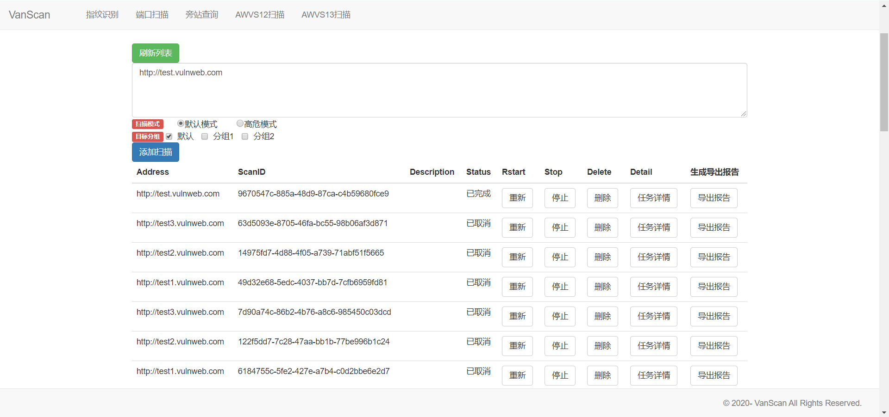
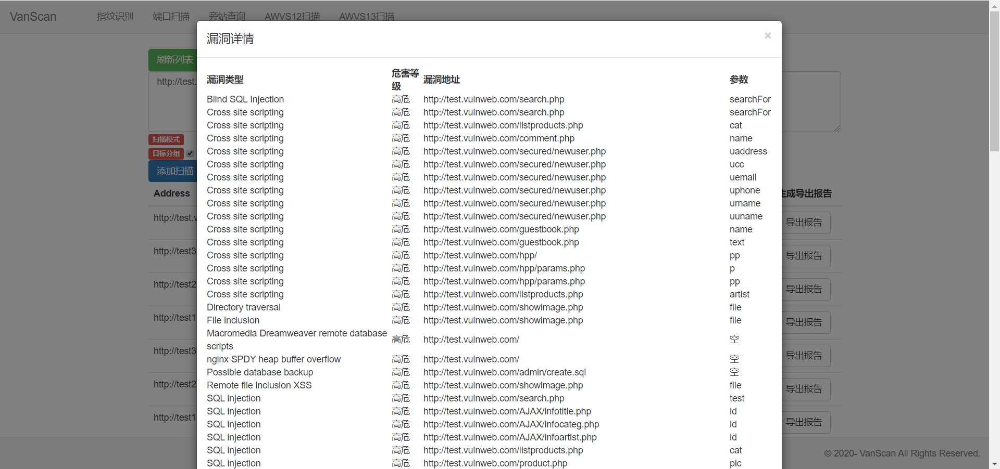
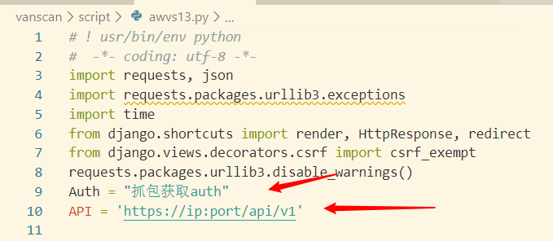
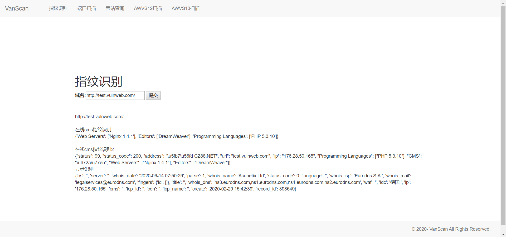
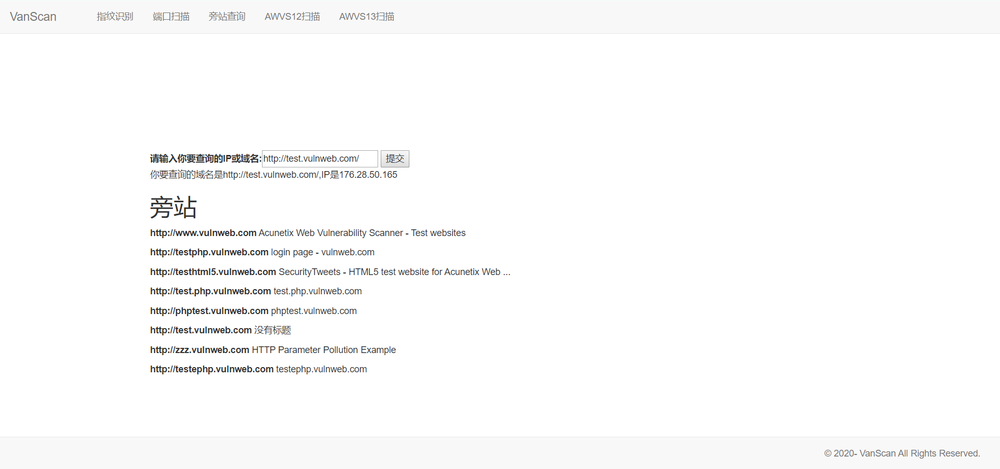

# vanscan
打算做一个信息搜集、扫C段、指纹识别、漏洞扫描的轮子  
目前使用了https://github.com/Y4er/webscan 的demo,打算功能完善后，进行重构和前端修改
## awvs接口
[+]根据渗透习惯，新增了扫描模式。扫描模式可选`默认模式`和`高危模式`（默认模式=全量扫描，高危模式=只扫高风险漏洞）  
[+]新增`目标分组`，默认选择不分组，支持添加多个分组   
[+]一键查看`任务详情`，可显示漏洞名称、漏洞风险、漏洞url   
[+]一键`导出报告`，默认保存pdf在报告目录   
[+]一键`重新扫描`目标   
[+]支持`批量添加目标`   
调用awvs12或awvs13，后续添加poc专项扫描(pocsuite3框架)  
调用awvs需要修改 /script/awvs13.py 里的Auth

## 指纹识别
添加了云悉、bugscaner.com 在线指纹识别接口，前端尚未完成
轮子列表调研完毕，等待添加

## 端口扫描
默认扫描一些常用端口
## 旁站查询
查询旁站域名、title

